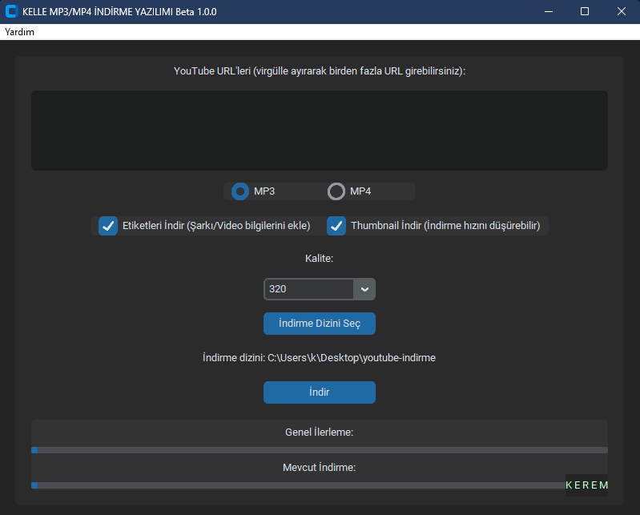

# yt-indirici

MP3/MP4 İndirmeye yarayan YouTube indirme yazılımı.

## Özellikler

- YouTube videolarını MP3 veya MP4 formatında indirme.
- Çoklu URL desteği.
- Metadata ve thumbnail indirme seçenekleri.
- Kullanıcı dostu arayüz.

## Kurulum

1. **Projeyi İndirin**:
   - GitHub sayfasından projeyi indirin veya `git clone` ile klonlayın.

2. **FFmpeg'i İndirin**:
   - [FFmpeg resmi sitesinden](https://ffmpeg.org/download.html) FFmpeg'i indirin ve çıkartın.
   - `ffmpeg/bin` adında bir klasör oluşturun ve içine `ffmpeg.exe` ve `ffprobe.exe` dosyalarını kopyalayın.
   - Bu `ffmpeg/bin` klasörünü, `app.py` dosyasının bulunduğu ana dizine taşıyın.

3. **Gerekli Paketleri Yükleyin**:
   - Proje dizininde bir terminal açın ve aşağıdaki komutu çalıştırarak gerekli Python paketlerini yükleyin:
     ```bash
     pip install -r requirements.txt
     ```

4. **Uygulamayı Çalıştırın**:
   - Aşağıdaki komutla uygulamayı başlatın:
     ```bash
     python app.py
     ```

## Kullanım

1. **URL Girişi**:
   - Ana ekranda YouTube URL'lerini virgülle ayırarak girin.

2. **Format Seçimi**:
   - MP3 veya MP4 formatı arasından seçim yapın.

3. **Kalite Seçimi**:
   - İstenilen kaliteyi seçin (örneğin, MP3 için 128, 192, 256, 320 kbps).

4. **İndirme Dizini Seçimi**:
   - İndirilen dosyaların kaydedileceği dizini seçin.

5. **İndirme Butonu**:
   - "İndir" butonuna tıklayarak indirme işlemini başlatın.

## Ekran Görüntüleri



## Katkıda Bulunma

Eğer projeye katkıda bulunmak isterseniz, lütfen aşağıdaki adımları takip edin:

1. Bu depoyu çatallayın (fork).
2. Yeni bir özellik veya düzeltme için bir dal (branch) oluşturun: `git checkout -b yeni-ozellik`.
3. Değişikliklerinizi yapın ve bunları işleyin (commit): `git commit -m 'Yeni özellik eklendi'`.
4. Dalınıza itin (push): `git push origin yeni-ozellik`.
5. Bir birleştirme isteği (pull request) gönderin.

## Lisans

Bu proje MIT Lisansı altında lisanslanmıştır. Daha fazla bilgi için [LICENSE](LICENSE) dosyasına bakın.

## YAPAY ZEKA YARDIMLI YAPILMIŞTIR

Bu proje, yapay zeka yardımıyla geliştirilmiştir.
